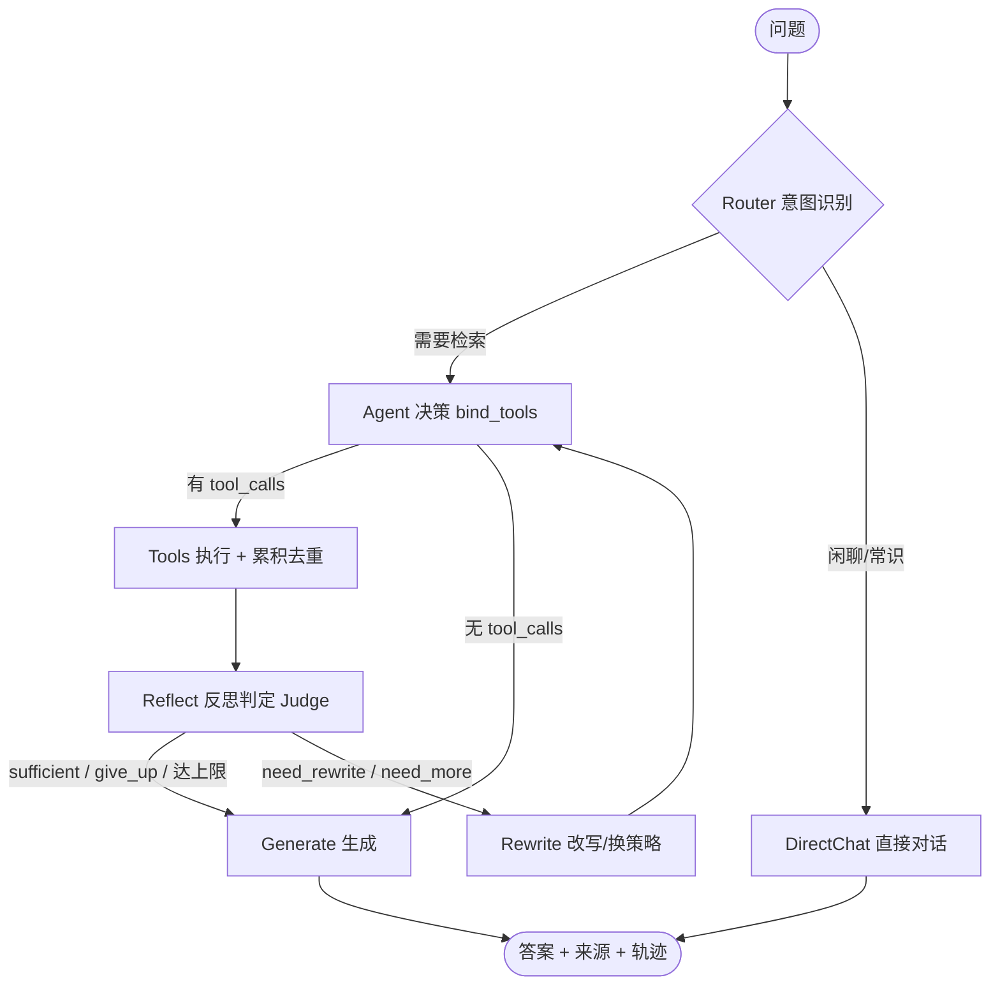

# Obsidian RAG —— 个人知识库智能问答系统

> 基于个人 Obsidian 笔记库构建的垂直领域 RAG 系统，支持自然语言问答、来源溯源、混合检索、双链关联扩展，并在 Naive RAG 之上叠加 Agentic RAG 决策-反思循环，具备量化评测与公网部署能力。

## 一、项目整体描述

### 1.1 项目背景

Obsidian 是我的个人知识库，累计数百篇 Markdown 笔记，涵盖技术学习、算法推导、项目记录等内容。传统检索方式（Obsidian 内置搜索、文件名模糊匹配）无法处理"语义层面"的提问，例如：

- "我之前记的 FlashAttention 的优化点有哪些？"
    
- "LoRA 和 QLoRA 的区别，我笔记里是怎么写的？"
    
- "RAG 的 chunk 策略我对比过哪几种？"
    

这类问题需要**跨笔记、跨标题、结合上下文**才能回答，且必须**标注来源**（哪篇笔记、哪个标题下），否则无法验证正确性。

### 1.2 项目定位

面向**个人 Obsidian 笔记库**的垂直 RAG 问答系统，区别于通用知识库 RAG 的三个差异化点：

- **数据结构感知**：解析 Markdown 标题层级、YAML front matter（tags/aliases/created）、`[[wikilink]]` 双链
    
- **双链关联检索**：基于 `[[wikilink]]` 构建笔记关联图（NetworkX），检索时扩展一跳关联 chunk，GraphRAG 雏形
    
- **个人数据闭环**：数据不出本地（embedding + reranker 全本地），生成侧可切换本地/API
    

### 1.3 核心功能点

| 功能           | 说明                                                                        |
| ------------ | ------------------------------------------------------------------------- |
| 自然语言问答       | 用户输入问题，系统返回答案 + 来源（文件路径、标题路径）                                             |
| 混合检索         | 稠密向量（bge-m3）+ BM25 稀疏，加权融合                                           |
| Rerank       | 本地 BGE-Reranker-v2-m3 对 TopK 重排序                                      |
| Query 改写    | LLM 将口语化问题改写为"笔记中可能出现的陈述句"                                                |
| 双链关联扩展       | 检索命中 chunk 后，自动扩展其 `[[wikilink]]` 一跳邻居                                    |
| 增量索引         | 新增/修改笔记后增量更新 ChromaDB，不需全量重跑                                              |
| Agentic RAG | 自写 LangGraph 状态图编排"决策-检索-反思"循环：路由识别意图、多轮检索累积去重、Reflection Judge 判定信息是否充足（不足则改写/换策略再查）、充足才生成带引用答案；闲聊直接对话不检索 |
| 语义缓存         | 精确命中 + 近邻命中（embedding 余弦）两级缓存，带 TTL/FIFO 淘汰                                  |
| 量化评测         | 轨迹级评测（路由分布/检索轮次/工具调用/Judge 判定）+ Ragas（Faithfulness / Answer Relevancy）      |
| Web UI       | Streamlit 前端，来源折叠展示 + 追踪模式可视化 Agent 思考/工具调用/观察/反思全过程                    |
| 公网部署         | Docker + 腾讯云轻量 2C4G，面试官可点开                                                  |

---

## 二、技术栈说明

### 2.1 核心技术栈总览

| 层级        | 技术                                                              | 用途                                                          |
| --------- | --------------------------------------------------------------- | ----------------------------------------------------------- |
| 数据层       | Obsidian Vault（`.md`）                                           | 原始知识库                                                       |
| 解析层       | Python（`markdown`, `pyyaml`, `obsidiantools`）                   | 读取 `.md`、解析 front matter、提取 `[[wikilink]]`                  |
| 分块层       | `MarkdownHeaderTextSplitter` + `RecursiveCharacterTextSplitter` | 按 `#/##/###` 标题层级切分，长 chunk 递归再切                            |
| Embedding | **Ollama `bge-m3:latest` **（本地）                                 | 稠密向量（1024 维），Ollama 已装，仅用 dense 信号                          |
| 稀疏信号      | `rank-bm25`                                                     | 补 Ollama 不暴露的 bge-m3 sparse 向量，BM25 等价替代                   |
| 向量库       | **ChromaDB**​                                                   | 自动持久化（SQLite）+ metadata 过滤（filepath / tags / heading）       |
| Reranker  | **BAAI/bge-reranker-v2-m3**（本地，`FlagReranker`）                | 从 modelscope 下载，~1.1 GB，本地 `use_fp16=True` 跑                |
| 生成模型      | **agnes**（OpenAI 兼容网关，API）                                    | 经 `llm/client.py::get_llm()` 统一收敛所有 agent 链路 LLM 调用（配置 `agnes_api_key` / `agnes_base_url` / `agnes_model`） |
| 生成备选      | Qwen 2.5-7B-Instruct（本地）/ Qwen3-Coder-Plus（长上下文场景）          | 本地兜底 / 长上下文 agent 场景                                        |
| Agent 编排  | **LangGraph**（`StateGraph`）                                   | 自写显式状态图：Router → Agent → Tools → Reflect → Rewrite → Generate / DirectChat，非 `create_react_agent` 黑盒 |
| 语义缓存      | 精确命中（归一化 SHA256）+ 近邻命中（embedding 余弦）                        | TTL + FIFO 淘汰，embedding 失败自动降级"仅精确"                              |
| 持久层       | **SQLite**                                                     | 三张表 `runs` / `run_events` / `session_turns`，支持断流续传与跨会话记忆            |
| 后端        | **FastAPI**                                                    | `/ask`、`/ask_stream`（Naive RAG）+ `/agent/ask`、`/agent/ask_stream`（SSE）、`/agent/runs/{run_id}`、`/agent/sessions/{session_id}`（Agentic RAG） |
| 前端        | **Streamlit**                                                  | 输入框 + 聊天历史 + 来源折叠 + 追踪模式可视化 Agent 思考/工具/观察/反思全过程            |
| 评测        | **Ragas**（守卫式接入）                                                  | 轨迹级评测（路由/轮次/工具/Judge）+ Faithfulness / Answer Relevancy              |
| 图结构       | NetworkX                                                        | 双链 `[[wikilink]]` → 有向图，一跳扩展                                |
| 开发环境      | WSL 2 + Docker Desktop                                          | Ollama 在 WSL 原生跑，Docker 通过 `host.d.docker.internal:11434` 连 |
| 部署        | Docker Compose + 腾讯云轻量 2C4G                                  | 公网 URL，面试官可点                                                |
| AI 辅助     | Cursor + Claude Code (Sonnet)                                   | 代码生成 + plan mode 诊断                                         |

### 2.2 技术选型的关键决策

> 📌 **为什么 ChromaDB 而不是 FAISS？**​
> 
> 个人场景（几万 chunk）FAISS 和 Chroma 性能差距可忽略，但 Chroma 自动持久化 + `where` metadata 过滤（按 tags/filepath/heading 过滤）对 Obsidian 场景非常顺手，FAISS 要自己搞。

> 📌 **为什么 Ollama bge-m3 而不用 bge-large-zh-v1.5？**​
> 
> 已装 Ollama，bge-m3 C-MTEB 中文 65.79 > v1.5 的 64.53，且 8192 上下文更长。代价是 Ollama 只暴露 dense 向量，sparse 用 BM25 补——等价替代，不亏。

> 📌 **为什么 FastAPI 而不是 LangServe 直接挂？**​
> 
> LangServe 够 V1 用，但后续要加"来源溯源格式化 + 双链扩展 + 流式 yield"时，FastAPI 自己写更可控。

> 📌 **为什么自写 LangGraph `StateGraph` 而不是 `create_react_agent`？**
> 
> 早期用 `create_react_agent` 是个"黑盒"，反思/改写/多跳累积的退出条件不好控制。自写 `StateGraph` 把每个节点（Router / Agent / Tools / Reflect / Rewrite / Generate / DirectChat）显式拆开，分支逻辑（`_route_branch` / `_agent_branch` / `_reflect_branch`）清晰可观测，后期调优和 debug 更可控。

---

## 三、项目难点
### 复杂文档处理

| **  内容类型  ** | **  要不要向量化  ** | **  做法  **    |
| ------------------------ | -------------------------- | ------------------------- |
| 普通正文文本                   | ✅                          | 正常切 chunk + embed         |
| Markdown 表格              | ✅ 但要结构化                    | 表级 summary + 行级切片，双路存     |
| Mermaid 流程图              | ✅ 但特殊                      | 源码保留 + LLM 生成文字描述一起 embed |
| 图片                       | ⚠️ 看情况                     | 路径存 metadata + 两种可选方案（见下） |

---

## 四、Agentic RAG 工作流程

在 Naive RAG（检索 → 重排 → 生成）之上，加了一层"决策-反思"调度（自写 LangGraph 状态图）。问题进来先路由，需要检索才进"检索循环"，够了才生成答案；闲聊类直接对话不检索。底层检索能力（hybrid / bm25 / vector / 图谱 / reranker）完全复用，Agent 只是上层调度。

### 4.1 整体链路

### 4.2 核心机制

- **Router（路由）**：`temperature=0.0` 的 LLM 分类"是否需要检索"。闲聊/问候/问身份/纯常识 → 走 `direct_chat` 完全不检索，省 token；问笔记内容 → 进检索循环。LLM 失败兜底为"需要检索"。
- **Context Accumulator（上下文累积器）**：每轮 Tools 把新结果按 `(filepath, heading_path)` 确定性去重后追加，生成前按 rerank 分数 Top-K（默认 5）裁剪，既保证多跳信息完整又防超窗口。
- **Reflection Judge（反思判定）**：生成前用 `temperature=0.0` 的 LLM 当"裁判"，输出四态 verdict：`sufficient`（够 → 生成）/ `need_rewrite`（不够 → 改写查询再查）/ `need_more`（不够 → 换工具/策略再查）/ `give_up`（多次无内容 → 生成并标注"信息有限"）。`iteration >= MAX_ITER`（默认 3）时无论判定如何强制生成，防死循环。
- **工具集（7 个原子工具）**：`hybrid_search` / `graph_expand` / `vector_search` / `bm25_search` / `filtered_search` / `get_note` / `query_rewrite`，统一入口带重试/降级/兜底三层防护。

### 4.3 接口与前端

- 后端：`/agent/ask`（非流式）、`/agent/ask_stream`（SSE 流式，事件含 `thought` / `tool_call` / `observation` / `judge` / `answer` / `sources` / `run` / `cached` / `error`，首事件 `run` 带 `run_id` 作断流续传锚点）、`/agent/runs/{run_id}`、`/agent/sessions/{session_id}`。旧 `/ask*` 端点保留指向 Naive RAG 作对比。
- 前端：追踪模式把 Agent 的推理过程渲染成可折叠步骤面板，最终答案嵌进流程（「信息充足，生成答案」之后、「✅ 完成」之前）；`session_id` 由前端生成并随请求带上，跨会话记忆生效。
