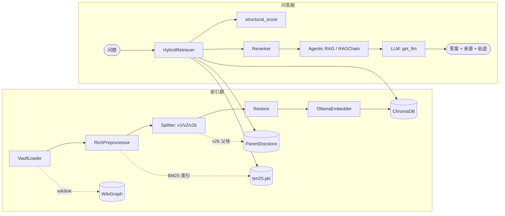
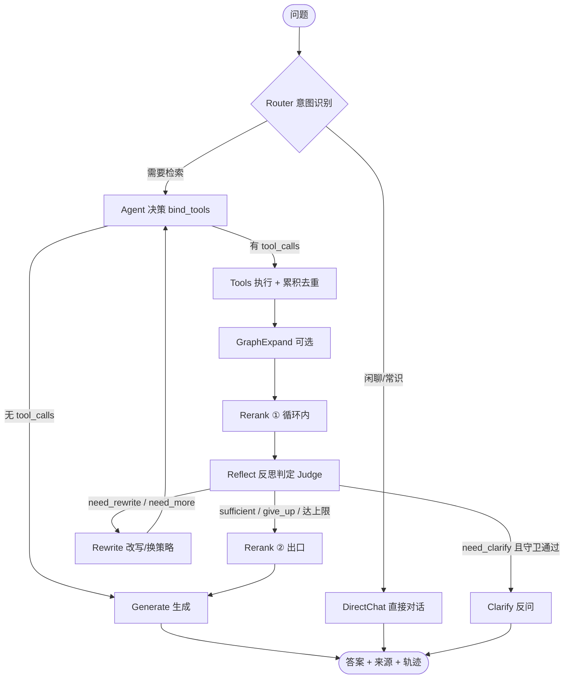

# Obsidian RAG —— 个人知识库智能问答系统

> 基于个人笔记库构建的垂直领域 RAG 系统：自然语言问答 + 来源溯源 + 混合检索 + 结构优先 + 双链关联扩展，并在 Naive RAG 之上叠加 **Agentic RAG**（自写 LangGraph 状态图编排"路由-检索-反思-澄清"循环）。具备语义缓存、上下文预算管理、会话持久化与量化评测能力，可本地运行，亦能容器化对外提供服务。

---

## 一、项目概述

### 1.1 背景

利用Markdown打造个人知识库，使用Obsidian进行管理，累计数百篇 Markdown 笔记，涵盖技术学习、算法推导、项目记录等内容。传统检索（Obsidian 内置搜索、文件名模糊匹配）无法处理"语义层面"的提问，例如：

- "我之前记的 FlashAttention 的优化点有哪些？"
- "LoRA 和 QLoRA 的区别，我笔记里是怎么写的？"
- "RAG 的 chunk 策略我对比过哪几种？"

这类问题需要**跨笔记、跨标题、结合上下文**才能回答，且必须**标注来源**（哪篇笔记、哪个标题下），否则无法验证正确性。

### 1.2 定位（差异化）

面向**个人本地Markdown笔记库**的垂直 RAG 问答系统，三个差异化点：

- **数据结构感知**：解析 Markdown 标题层级、YAML front matter（tags/aliases/created）、`[[wikilink]]` 双链
- **结构优先检索**：在稠密+稀疏融合分之上叠加"文档标题/层级标题/目录"结构分，让"哪篇/哪章"类问题命中更准（GraphRAG 雏形）
- **个人数据闭环**：embedding + reranker 全本地，生成侧可切换本地/API

### 1.3 核心能力一览

| 能力 | 说明 |
| --- | --- |
| 自然语言问答 | 用户输入问题，返回答案 + 来源（文件路径、标题路径、命中片段预览） |
| 混合检索 | 稠密向量（bge-m3 via Ollama）+ BM25 稀疏（jieba 分词），加权融合 |
| 结构优先检索 | 在融合分上叠加 title/heading/dir 结构分（可配 `β` 权重 + `title_hit` 硬兜底），层级锚点类问题显著提效 |
| 父子双存切分（v2b） | 子块（800 字）进库检索，父块（整节）存 docstore，命中后回退整节给 LLM，兼顾"检得准"与"读得全" |
| Reranker（双层） | 本地 BGE-Reranker-v2-m3：循环内闸门（tools→reflect）+ 出口总安检（reflect→generate），可独立开关 |
| Query 改写 | LLM 将口语化问题改写为"笔记中可能出现的陈述句" |
| 双链关联扩展 | 基于 `[[wikilink]]` 构建 NetworkX 有向图，命中后沿一跳邻居扩展关联笔记（默认关闭，可配） |
| 增量索引 | 按 mtime + sha256 增量更新 ChromaDB 与 BM25 索引，不需全量重跑 |
| Agentic RAG | 自写 LangGraph 状态图：Router → 多轮检索 → Reflection Judge →（改写/换策略/澄清）→ 带引用生成；闲聊直接对话不检索 |
| 澄清 / 反问 | Judge 判 `need_clarify` 且多道守卫通过时，返回带具体选项的澄清问句（而非空泛反问），跨轮靠历史自然消解 |
| 上下文管理 | 问题凝练（消指代）、三段式 token 预算、跨轮累积衰减/截断、长程滚动摘要、历史相关性裁剪 |
| 语义缓存 | 精确命中 + 近邻命中（embedding 余弦）两级缓存，带 TTL/FIFO 淘汰，embedding 失败自动降级"仅精确" |
| 会话持久化 | 轻量 SQLite 记录 runs / run_events / session_turns，支持断流续传与跨会话记忆 |
| 量化评测 | 检索指标（MRR/Recall/NDCG/Precision@K）+ 生成指标（手写 + Ragas Faithfulness/Answer Relevancy）+ 轨迹级评测（路由/轮次/工具/Judge） |
| Web UI | Streamlit 前端，来源折叠展示 + 追踪模式可视化 Agent 思考/工具/观察/反思全过程 |
| 对外服务 | FastAPI 后端（`/ask`、`/agent/*` 等端点），可容器化部署 |

---

## 二、系统架构

### 2.1 模块全景

```
src/note_assistant/
├── config.py              # pydantic-settings 统一配置（.env / .env.local 双加载）
├── llm/client.py          # get_llm()：所有 LLM 调用统一收敛到 AGENT_*（OpenAI 兼容网关）
├── indexing/              # 索引链路
│   ├── vault_loader.py    # 扫描 vault、容错解析 front matter、提取 wikilink 与标题树 → DocNode
│   ├── preprocessor.py    # RichPreprocessor：代码/表格/mermaid/图片占位 → 切分后 restore + 摘要块
│   ├── splitter.py        # split_v1 / split_v2 / split_v2b（父子双存）
│   ├── embedder.py        # OllamaEmbedder（bge-m3:latest，1024 维 dense）
│   ├── ingestor.py        # Ingestor.index_vault()：load→preprocess→split→restore→enrich→upsert
│   └── sync.py            # SyncDB：mtime+sha256 增量索引
├── retrieval/             # 检索链路
│   ├── sparse_retriever.py# BM25（jieba 分词）+ pickle 持久化
│   ├── hybrid.py          # HybridRetriever：dense+sparse 融合 + 结构分 + v2b 父块回退
│   ├── structural.py      # structural_score：title/heading/dir 结构分
│   ├── docstore.py        # ParentDocstore：v2b 父块存储（pickle）
│   ├── reranker.py        # 本地 BGE-Reranker-v2-m3（FlagReranker, fp16）
│   ├── query_rewrite.py   # 口语 → 陈述句
│   ├── graph.py           # WikiGraph：NetworkX 双链图，BFS 一跳扩展 + decay
│   └── types.py           # RetrievalResult 统一返回
├── generation/            # 生成
│   └── generator.py       # LangChain ChatPromptTemplate + 流式输出（Naive RAG 用）
├── pipeline/
│   └── rag_chain.py       # RAGChain：检索 → rerank → 图扩展 → 生成（Naive RAG 生产路径）
├── agent/                 # Agentic RAG
│   ├── agent.py           # 自写 LangGraph StateGraph：router/agent/tools/reflect/rewrite/generate/clarify...
│   ├── tools.py           # 7 个原子工具（hybrid_search/graph_expand/vector_search/bm25_search/filtered_search/query_rewrite/get_note）
│   ├── context.py         # ContextManager：凝练/预算/累积/压缩/长程摘要/相关性裁剪/缓存指纹
│   ├── cache.py           # SemanticCache：精确 + 近邻（embedding 余弦）
│   ├── runner.py          # AgentRunner：ainvoke/astream 封装 + 缓存 + 持久化
│   ├── store.py           # AgentStore：SQLite 持久化（runs/sessions）
│   └── evaluation.py      # Agent 轨迹级评测
├── evaluation/            # 离线评测
│   ├── eval_dataset.py    # 评测集
│   ├── evaluator.py       # 编排器：批量跑 → 指标报告
│   ├── retrieval_metrics.py / generation_metrics.py / ragas_metrics.py
└── api/
    ├── main.py            # FastAPI 入口（全部端点）
    └── schemas.py         # 请求/响应模型
```

### 2.2 数据流



---

## 三、技术栈

| 层级 | 技术 | 用途 |
| --- | --- | --- |
| 数据层 | Obsidian Vault（`.md`） | 原始知识库 |
| 解析层 | PyYAML + 自写容错解析；`re` 提取 `[[wikilink]]` 与标题树 | front matter / 双链 / 标题层级 |
| 分块层 | `MarkdownHeaderTextSplitter` + `RecursiveCharacterTextSplitter` | 按 `#/##/###` 层级切分，长 chunk 递归再切；v2b 额外产出父块 |
| Embedding | **Ollama `bge-m3:latest`**（本地） | 稠密向量（1024 维），仅用 dense 信号 |
| 稀疏信号 | `rank-bm25` + `jieba` 分词 | 补 Ollama 不暴露的 sparse 向量，BM25 等价替代 |
| 结构分 | `jieba` 复用 | title(0.6)/heading(0.3)/dir(0.1) 结构重叠度 |
| 向量库 | **ChromaDB**（>=1.0） | 自动持久化（SQLite）+ metadata 过滤（filepath/tags/heading） |
| 父块存储 | pickle `ParentDocstore` | v2b 父块，不参与 embedding/BM25，命中后按需取回 |
| Reranker | **BAAI/bge-reranker-v2-m3**（本地，`FlagReranker`, `use_fp16=True`） | 交叉编码精排，双层（循环内 + 出口） |
| 生成模型 | **统一 LLM 通道**（OpenAI 兼容网关，配置 `agent_base_url`/`agent_api_key`/`agent_model`） | 所有 LLM 调用经 `llm/client.py::get_llm()` 收敛（当前指向 agnes 网关，可切 DeepSeek/本地 Qwen 等） |
| Agent 编排 | **LangGraph**（`StateGraph`） | 自写显式状态图：Router → Agent → Tools → Reflect → Rewrite/Clarify → Generate / DirectChat |
| 语义缓存 | 精确（归一化 SHA256）+ 近邻（embedding 余弦） | TTL + FIFO，embedding 失败降级"仅精确" |
| 持久层 | **SQLite** | `runs`/`run_events`/`session_turns` 三张表，断流续传 + 跨会话记忆 |
| 后端 | **FastAPI**（默认端口 8005） | 全部问答/追踪/会话/配置/重索引端点 |
| 前端 | **Streamlit** | 输入框 + 聊天历史 + 来源折叠 + 追踪模式可视化 Agent 全过程 |
| 评测 | **Ragas**（守卫式接入）+ 手写指标 | 检索/生成/轨迹三级评测 |
| 图结构 | NetworkX | 双链 `[[wikilink]]` → 有向图，一跳扩展 |
| 开发/运行 | `uv` 包管理；Python 3.12 | 依赖隔离、可复现环境 |

---

## 四、核心能力详解

### 4.1 索引与切分

数据链路：`VaultLoader → DocNode → RichPreprocessor → split_* → restore → Ingestor → ChromaDB`。

- `split_v1`：扁平 `RecursiveCharacterTextSplitter`（对照基线）。
- `split_v2`：两层策略——`MarkdownHeaderTextSplitter`（保留 `#/##/###/####` 层级）→ `RecursiveCharacterTextSplitter`（800 字 / 150 重叠，中文感知 `。` 分隔）。每个 chunk 带 `heading_path` 元数据，如 `"一、背景 > 检索方法"`。
- **`split_v2b`（父子双存，已完整实现）**：在 v2 基础上额外产出**父块**（整节，≤ `parent_chunk_size`）存入 `ParentDocstore`（pickle）；子块（800 字）带 `parent_id` 进 ChromaDB 检索。检索命中子块后，按 `parent_id` 回退整节给 LLM，解决"子块检得准但上下文被切碎"的问题。切换策略需重建向量库生效。

前端占位（代码/表格/mermaid/图片）经 `RichPreprocessor` 占位 → 切分 → `restore()` 还原，并为每段富结构生成"摘要块"以保证可检索。

### 4.2 混合检索 + 结构优先

`HybridRetriever` 两路并行：

```
query ─┬─ embedding → ChromaDB(dense) ─┐
      └─ jieba → BM25Okapi(sparse) ─┤→ 归一化到 [0,1] → 加权融合 final = α·dense + (1-α)·sparse
                                     └→ structural_score 叠加（β 权重 + title_hit 硬兜底 bonus）
```

- α 来自 `dense_weight`（默认 0.7），sparse 权重 `bm25_weight`（默认 0.3）。
- `structural_score`：query 与 chunk 元数据（title/heading_path/dir）的 jieba 重叠度，title 命中（归一化包含）给硬兜底 bonus。弱结构信号低于 `structural_min_score` 时不做 boost，避免噪声翻车。`structure_weight=0` 时完全退化回纯融合，零回归。

### 4.3 Reranker（双层）

本地 `BGE-Reranker-v2-m3` 在两条闸口生效，均可独立开关对比：

1. **循环内闸门**（`agent_reranker_loop_enabled`）：每轮工具调用后对累积结果精排，保留 `agent_reranker_loop_top_k`（默认 10）。
2. **出口总安检**（`agent_reranker_exit_enabled`）：Judge 通过后对多轮累积做全局精排，裁到 `top_k_rerank`（默认 5）再生成。

### 4.4 Naive RAG 管线（`pipeline/rag_chain.py`）

生产路径（被 `/ask`、`/ask_stream`、`/ask_trace` 调用）：`HybridRetriever → Reranker → WikiGraph 扩展 → Generator`。支持非流式、SSE 流式、以及带检索步骤 trace 的流式（`/ask_trace`）。`rag_chain` 是活代码，不是死代码。

### 4.5 Agentic RAG（自写 LangGraph 状态图）

在 Naive RAG 之上加一层"决策-反思"调度。底层检索能力完全复用，Agent 只是上层调度。状态图（`agent/agent.py::build_graph`）：



核心机制：

- **Router**：`temperature=0.0` 的 LLM 分类是否需要检索。闲聊/问候/问身份/纯常识 → `direct_chat` 完全不检索；问笔记内容 → 进检索循环。失败兜底"需要检索"。
- **Context Accumulator**：每轮 Tools 按 `(filepath, heading_path)` 确定性去重后追加，生成前按 rerank 分数 Top-K 裁剪，既保多跳信息完整又防超窗口。
- **Reflection Judge**：生成前用 `temperature=0.0` 的 LLM 当裁判，输出五态 verdict：`sufficient` / `need_rewrite` / `need_more` / `give_up` / `need_clarify`。`iteration >= MAX_ITER`（默认 3）时强制生成防死循环。**P0 修复**：Judge 现在收到的是真实片段内容（含标题+正文摘要），而非改造前只传"片段数量"导致的盲判。
- **工具集（7 个原子工具）**：`hybrid_search` / `graph_expand` / `vector_search` / `bm25_search` / `filtered_search` / `get_note` / `query_rewrite`，统一入口带重试/降级/兜底三层防护。

### 4.6 澄清 / 反问（clarify-as-terminal）

当 Judge 判 `need_clarify`（检索命中两个及以上互不相干主题、无法判断指代），且**五道守卫**全部通过才反问：

1. 总开关 `agent_clarify_enabled` 开启；
2. Judge 确判 `need_clarify`；
3. 存在具体澄清问句（拒绝"你能说清楚点吗"这类空泛反问）；
4. 入口消解置信度 `< agent_clarify_confidence_threshold`（消解本就成功则不打扰）；
5. 上一轮未刚反问过（防连续追问）。

澄清问句以**普通 assistant 轮次**落库，作为本次请求正常结束（不挂起、不存 checkpoint）。用户下一轮回答进来时，靠历史自然消解出完整问题，无需新机制。

### 4.7 上下文管理（`agent/context.py`）

`ContextManager` 单例统一管理：

- **问题凝练（消指代）**：把"它/那/这个"类追问结合历史合成独立完整问题，router/检索/生成同源，避免指代导致 query 错误。
- **三段式 token 预算**：历史 + 累积 + 观察之和硬上限 `agent_total_context_token_budget`（默认 4500）；超预算按 `obs → accumulated → history` 优先级压缩。
- **跨轮累积双重保险**：每跨一轮 `score *= agent_accumulated_decay` + 按 token 预算硬截断。
- **长程滚动摘要**：原文 user/assistant 轮次 token 总和超 `agent_session_summary_threshold` 时生成摘要，保留最近 `agent_session_recent_keep` 轮原文。
- **历史相关性裁剪**：取最近 N 轮时间窗口，再按与凝练问题的 embedding 相似度 `>= agent_history_relevance_threshold` 裁剪；embedding 不可用则降级为时间窗口截断。

全部外部依赖（LLM/embedding/tiktoken）均注入 + 失败降级，沿用项目防御式风格。

### 4.8 语义缓存（`agent/cache.py`）

`SemanticCache`：精确命中（归一化 SHA256）+ 近邻命中（embedding 余弦，阈值 `agent_cache_semantic_threshold`）。带 TTL（`agent_cache_ttl`）+ FIFO（`agent_cache_max_size`），embedding 不可用自动降级"仅精确"。澄清问句**不进缓存**（避免反问死循环）。

### 4.9 会话持久化与断流续传（`agent/store.py`）

轻量 SQLite（`agent_db_path`，三张表 `runs`/`run_events`/`session_turns`）：

- **断流续传**：SSE 首事件带 `run_id`，客户端断流后用 `GET /agent/runs/{run_id}` 轮询，直到 `finished` 取回完整 answer + trajectory + sources。
- **跨会话记忆**：`session_id` 由前端生成并随请求带上；`GET /agent/sessions/{session_id}` 可取回历史。超时未完成（`agent_run_orphan_ttl`）的 run 标记为 `interrupted`（孤儿检测）。

### 4.10 评测体系（`evaluation/`）

`Evaluator.run()` 对评测集逐条：调用 `rag_chain.ask` → 提取召回文件与上下文 → 计算检索指标（MRR/Recall@K/NDCG@K/Precision@K）+ 生成指标（手写 + Ragas Faithfulness/Answer Relevancy）→ 汇总 `EvalReport`。Agent 侧另有轨迹级评测（路由分布/检索轮次/工具调用/Judge 判定），见 `agent/evaluation.py`。Ragas 走本地 Ollama（`ragas_*` 配置），避免外部依赖。

---

## 五、API 与前端

### 5.1 接口一览

| 方法 | 路径 | 说明 |
| --- | --- | --- |
| POST | `/ask` | Naive RAG 非流式问答（完整 answer + sources + timing） |
| POST | `/ask_stream` | Naive RAG 流式（SSE，逐 token + sources） |
| POST | `/ask_trace` | Naive RAG 带检索步骤 trace 的流式（embedding/dense/sparse/fusion/rerank/graph 各阶段耗时） |
| POST | `/agent/ask` | Agentic RAG 非流式（答案 + 去重来源 + 完整轨迹 + run_id） |
| POST | `/agent/ask_stream` | Agentic RAG 流式（SSE：thought/tool_call/observation/judge/answer/sources） |
| GET | `/agent/runs/{run_id}` | 取回某次运行快照（断流续传锚点） |
| GET | `/agent/sessions/{session_id}` | 取回某会话历史（跨会话记忆） |
| GET | `/health` | 健康检查（ChromaDB chunk 数 + 模型名），供 Docker/前端就绪检测 |
| GET | `/config` | 当前系统配置快照 |
| POST | `/reindex` | 增量索引（只更新变更文件） |

> 旧 `/ask*` 端点保留指向 Naive RAG，与 `/agent/*` 并存作对比/降级通道。

### 5.2 前端（Streamlit）

聊天界面，支持多轮连续对话。输出恒为流式（走 `/agent/ask_stream`）。侧边栏可切换**追踪模式**，实时展示"路由判定 → 工具调用 → 观察结果 → 反思判定 → 答案"，来源以可折叠面板呈现。

---

## 六、快速开始

### 6.1 环境要求

- Python 3.12（`pyproject` 锁定 `>=3.12,<3.13`）
- [Ollama](https://ollama.com) 本地运行，已拉取 `bge-m3:latest`（embedding）及可选的 Ragas 用本地小模型
- 本地下载 `BAAI/bge-reranker-v2-m3` 到 `models/` 目录（约 1.1 GB）
- 一个 Obsidian vault 路径，以及可用的 LLM 网关（配置 `AGENT_*`）

### 6.2 安装与配置

```bash
# 1. 安装依赖（uv 管理）
uv sync

# 2. 配置环境变量
cp .env.example .env   # 或编辑 .env / .env.local（.env.local 覆盖 .env）
# 关键项：VAULT_PATH、AGENT_BASE_URL、AGENT_API_KEY、AGENT_MODEL、OLLAMA_BASE_URL
```

### 6.3 索引

```bash
# 全量索引（首次）
uv run python -m note_assistant.indexing.ingestor

# 增量索引（新增/修改笔记后）
uv run python scripts/reindex.py

# 对比不同切分策略
uv run python -m note_assistant.indexing.splitter   # 加载 vault，对比 v1 vs v2
```

### 6.4 运行服务

```bash
# 后端（默认 8005）
uv run uvicorn note_assistant.api.main:app --host 0.0.0.0 --port 8005 --reload

# 前端（另开一个终端）
uv run streamlit run frontend/app.py
```

打开 Streamlit 地址（默认 `http://localhost:8501`），API 地址填 `http://localhost:8005`。

### 6.5 评测

```bash
uv run python scripts/run_eval.py        # 跑评测集，输出检索/生成/Ragas 指标
uv run python scripts/compare_retrieval.py   # A 纯向量 / B 混合 / C 混合+rerank 对比
uv run python scripts/demo_e2e.py        # 端到端冒烟测试
```

### 6.6 测试

```bash
uv run pytest                 # 全量
uv run pytest tests/agent     # 按模块
uv run ruff check .           # Lint
```

测试用 `tmp_path` 构造 mini vault，**不依赖真实 vault**；配置隔离用 `monkeypatch` + `_env_file=None`。

---

## 七、配置说明（关键 `settings`）

配置集中在 `src/note_assistant/config.py`（pydantic-settings，读 `.env` + `.env.local`）。常用项分组：

- **Vault / 索引**：`vault_path`、`chunk_size`(800)、`chunk_overlap`(150)、`chunking_strategy`(`v1`/`v2`/`v2b`)、`top_k_retrieve`(20)
- **Embedding / 向量**：`ollama_base_url`、`embed_model`(bge-m3:latest)、`embed_dim`(1024)、`chroma_persist_dir`、`collection_name`
- **Reranker**：`reranker_model`（本地路径）、`reranker_top_k`(10)、`top_k_rerank`(5)
- **检索融合**：`bm25_weight`(0.3)、`dense_weight`(0.7)
- **结构优先**：`structure_weight`(0.25)、`structural_min_score`(0.5)、`title_hit_bonus`(0.15)
- **v2b 父子双存**：`parent_chunk_size`(2000)、`parent_chunk_overlap`(200)、`parent_docstore_path`
- **LLM（统一通道）**：`agent_api_key`、`agent_base_url`、`agent_model`；备选 `deepseek_*`、`llm_model`
- **Agentic RAG**：`agent_max_iter`(3)、`agent_graph_expand_enabled`(默认关)、`agent_reranker_loop_enabled`/`agent_reranker_exit_enabled`、`agent_clarify_enabled`(默认开) 及澄清/凝练/摘要/相关性裁剪各项阈值
- **缓存 / 持久化**：`agent_cache_enabled`、`agent_cache_ttl`、`agent_session_enabled`、`agent_db_path`、`agent_run_orphan_ttl`
- **Ragas**：`ragas_base_url`、`ragas_api_key`、`ragas_llm_model`
- **LangSmith（可选追踪）**：`langsmith_tracing_enabled`、`langsmith_api_key`、`langsmith_endpoint`、`langsmith_project`

---

## 八、技术选型关键决策

> 📌 **为什么 ChromaDB 而不是 FAISS？**
> 个人场景（几万 chunk）性能差距可忽略，但 Chroma 自动持久化 + `where` metadata 过滤（按 tags/filepath/heading）对 Obsidian 场景顺手，FAISS 要自己搞。

> 📌 **为什么 Ollama bge-m3 而不用 bge-large-zh-v1.5？**
> 已装 Ollama，bge-m3 C-MTEB 中文 65.79 > v1.5 的 64.53，且 8192 上下文更长。代价是 Ollama 只暴露 dense 向量，sparse 用 BM25 补——等价替代，不亏。

> 📌 **为什么 FastAPI 而不是 LangServe 直接挂？**
> 后续要加"来源溯源格式化 + 双链扩展 + 流式 yield"时，FastAPI 自己写更可控。

> 📌 **为什么自写 LangGraph `StateGraph` 而不是 `create_react_agent`？**
> 早期用 `create_react_agent` 是"黑盒"，反思/改写/多跳累积的退出条件不好控制。自写 `StateGraph` 把每个节点（Router / Agent / Tools / Reflect / Rewrite / Clarify / Generate / DirectChat）显式拆开，分支逻辑（`_route_branch` / `_agent_branch` / `_reflect_branch` / `_should_clarify`）清晰可观测，调优和 debug 更可控。

---

## 九、项目结构

```
note-assitant/
├── src/note_assistant/      # 全部源码（见 §2.1 模块全景）
├── tests/                   # 测试（mirror src 结构：indexing/retrieval/pipeline/agent/evaluation）
├── scripts/                 # 运维脚本：ingestor 全量、reindex 增量、demo_e2e、compare_retrieval、run_eval
├── docs/                    # 设计文档：agentic-rag / clarification / context-manager / 层级检索 / 父子双存 / 评估报告
├── data/                    # 运行产物：chroma/、bm25.pkl、docstore.pkl、agent.sqlite、logs/
├── models/                  # 本地模型权重（bge-reranker-v2-m3 等）
├── frontend/                # Streamlit 应用
├── eval/                    # 评测相关资源
├── AGENTS.md / CLAUDE.md    # 给 AI 编码助手的项目指引
├── DECISIONS.md             # 决策与踩坑记录
└── README.md
```

---

## 十、评测与部署

- **评测**：见 §4.10 与 §6.5。设计评审报告在 `docs/工程化评估报告.md`、`docs/技术深度评估报告.md`。
- **部署**：后端 FastAPI 可经 `uvicorn` 直接运行，或容器化（Docker + 反向代理）对外提供。索引产物在 `data/`，模型权重在 `models/`，注意将 `VAULT_PATH`、模型路径与 `AGENT_*` 凭据注入运行环境。前端 Streamlit 通过 CORS 访问 `/agent/*` 端点。
