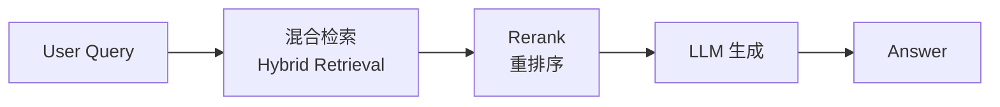
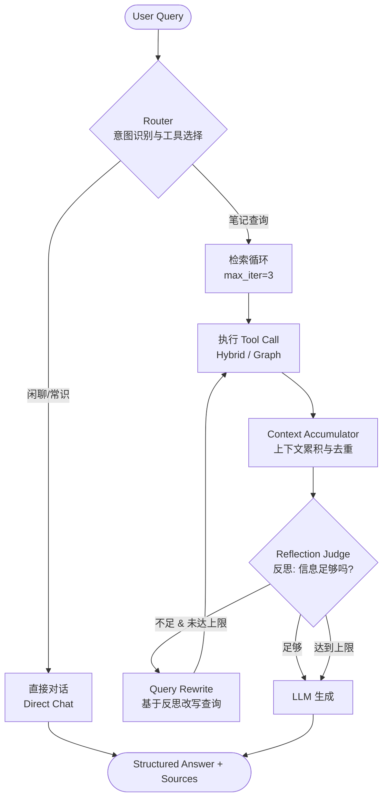

# Agentic RAG 架构设计蓝图

> 文档版本：v1.0
> 创建日期：2026-07-19
> 所属分支：`feat/agentic-rag`
> 关联文档：`工程化评估报告.md`、`技术深度评估报告.md`、`Day4-评测体系.md`
> 定位：本文件是 Agentic RAG 改造阶段的**指导性设计文档**，记录已与用户协商敲定的架构决策与落地路线。具体代码实现以 `src/note_assistant/agent/` 与 `src/note_assistant/llm/` 为准。

---

## 一、背景与目标

项目当前已具备完整的传统 RAG 能力（`indexing/` 与 `retrieval/` 基本成型，`pipeline/RAGChain` 是一条写死的线性流水线）。其核心短板是：**没有"决策—反思"机制**，无法处理多跳推理、对比分析、上下文缺失需补全的复杂问题。

本次改造目标：在传统 RAG 之上引入一层 **agent 循环**，让系统具备"规划 → 检索 → 反思 → 必要时再检索 → 综合生成"的能力，同时**保留原有 Naive RAG 作为对比基线**。

设计遵循"渐进式架构"原则：**先跑通主干（V1），再迭代分支（V2）**，不追求一步到位。

---

## 二、设计理念：渐进式 V1 → V2

| 阶段 | 名称 | 核心特征 | 适用场景 |
|---|---|---|---|
| V1 | Naive RAG（已有） | 单向执行、无反馈、无循环 | 定义明确、答案集中的事实性问答 |
| V2 | Agentic RAG（本次改造） | 双向反馈、带状态循环、动态路由 + 上下文累积 | 多跳推理、对比分析、上下文缺失需补全的复杂问题 |

**关键约束**：V2 不动 `indexing/` 与 `retrieval/` 底层，只把"编排层"从固定流水线换成 agent 循环，底层能力改造为 agent 可调用的工具。原有 `RAGChain` 保留为兜底与对比基线。

---

## 三、架构链路

### 3.1 V1 链路：线性流水线（现状）



### 3.2 V2 链路：智能循环系统（目标）



> 说明：V2 采用 **ReAct 范式**（边想边做），而非 Plan-and-Execute（先出计划再执行）。对单轮知识库问答，ReAct 轨迹更自然、更适合前端可视化展示"思考 → 检索 → 再思考"，实现也更轻。

---

## 四、核心改造点（The "Why" & "What"）

### 4.1 Router（路由节点）
- **V1 现状**：所有输入直接进入检索模块。
- **V2 改造**：增加**意图识别层**。调用检索前先判断用户意图，闲聊/人设类问题直接绕过检索返回答案，降低 token 成本；复杂问题决定调用单个还是组合工具（如先查概念 A，再通过图谱查关联概念 B）。
- **价值**：工业级系统第一优先级——可观测（决策离散可记录）+ 省成本（闲聊不进循环）。

### 4.2 Context Accumulator（上下文累积器）
- **V1 现状**：每次检索结果独立，多轮检索时旧信息被覆盖。
- **V2 改造**：维护全局 `accumulated_context` 列表，每一轮检索到的文档**追加**并基于 `(filepath, heading)` **确定性去重**（不依赖 LLM，保证确定性），生成前再按 Reranker 分数做 Top-K 裁剪，避免超窗口。
- **价值**：多跳检索结果完整保留，不丢失信息；是 Agentic 区别于 Naive 的核心状态管理。

### 4.3 Reflection Judge（反思判定节点）
- **V1 现状**：检索不到就直接回答"不知道"或产生幻觉。
- **V2 改造**：生成前评估已收集上下文是否足以回答问题，决定 `Sufficient=True`（进入生成）或 `Sufficient=False`（触发改写，进入下一轮循环）。`iteration >= max_iter` 时强制进入生成，并在回答中提示"部分信息可能不全"（降级策略）。

### 4.4 工具集（Tool Schema）
底层检索能力封装为原子工具，第一批**最小集**只开放两个，跑通后再扩展：

| 工具名称 | 功能 | 状态 |
|---|---|---|
| `hybrid_search` | 向量与 BM25 加权融合检索（通用快捷入口） | ✅ 第一批 |
| `graph_expand` | 基于 `[[wikilinks]]` 的图谱一跳扩展（关联推荐/溯源） | ✅ 第一批 |
| `vector_search` / `bm25_search` | 单独语义/关键词召回 | 🚧 后续扩展 |
| `filtered_search` | 按 tag/path/heading 元数据过滤（ChromaDB `where`） | 🚧 后续扩展 |
| `query_rewrite` / `get_note` | 改写查询 / 整篇读取 | 🚧 后续扩展 |

> 决策说明：agent 自主决策时很难判断"该用向量还是 BM25"，`hybrid_search` 已融合两者，是更稳的默认入口；单独开放反而增加 LLM 决策噪音。

---

## 五、已协商敲定的关键决策（ADR 记录）

以下为与用户逐条确认的结论，作为本次实现的硬性约束：

| 编号 | 议题 | 决策 | 理由 |
|---|---|---|---|
| ADR-1 | Agent 范式 | **ReAct**（非 Plan-and-Execute） | 单轮知识库问答最自然，轨迹易可视化，实现轻 |
| ADR-2 | 第一批工具范围 | **最小集**：`hybrid_search` + `graph_expand` | 先跑通最小闭环，降低调试面 |
| ADR-3 | 现有 RAGChain 去留 | **保留作兜底/对比** | 风险最低，便于横向评测，不废弃 |
| ADR-4 | Agent LLM 通道 | **复用 agnes（OpenAI 兼容网关）** | 配置为 `agnes_api_key` / `agnes_base_url` / `agnes_model`；`get_llm()` 统一收敛所有 agent 链路 LLM 调用（`config.py` 中 `deepseek_*` / `llm_model` 为残留字段，agent 路径已不用） |
| ADR-5 | 编排实现 | **自写 `StateGraph`**（非 `create_react_agent` 黑盒） | 需显式 Accumulator 状态管理与去重，黑盒无法精确控制 |
| ADR-6 | Router 节点 | **显式前置节点** | 省钱、可观测、ROI 最高，优先做 |
| ADR-7 | Reflection Judge | **先软约束（system prompt）**，跑通后升级为独立可观测节点 | 轻量优先，避免一次铺太大 |
| ADR-8 | 接口命名 | **新增 `/agent/ask` 与 `/agent/ask_stream`**，不改造原 `/ask` | 与 ADR-3 保留 RAGChain 一致 |

---

## 六、技术决策与权衡

**为什么采用显式节点（而非黑盒 ReAct）**：
- **可观测性**：Router / Judge 是离散、可记录、可回放的决策事件，线上 debug 可定位根因；黑盒把规划、反思、停止压在一次输出里，不可观测。
- **成本控制**：显式 Router 让闲聊完全绕过检索循环，省 embedding + 多次 LLM 调用。
- **可靠性**：Accumulator 确定性去重 + 生成前 Top-K 裁剪，状态在 state 显式管理，不赌模型记忆。
- **可控性**：每个节点可挂 timeout / fallback / 降级，护栏精准。

**代价**：延迟与复杂度上升（多几次 LLM 调用 + 自写 StateGraph）。工业实践普遍"用延迟换质量、可控、可观测"，trade-off 值得。

---

## 七、模块划分与文件规划

新增/改造模块（均在 `src/note_assistant/` 下）：

```
llm/
  client.py      # 统一 agnes（OpenAI 兼容）LLM 客户端：.invoke / .astream / .bind_tools
                 # 路由、改写、生成、agent 全部改走它，取代原先散落的 longcat/裸 httpx 调用
agent/
  tools.py       # 最小工具集：hybrid_search、graph_expand（@tool 封装）
  agent.py       # 自写 StateGraph：Router 节点 + Tool 节点 + Accumulator + 软 Judge + Generate
  runner.py      # AgentRunner：ainvoke / astream，提取 answer + sources + 轨迹事件
api/
  main.py        # 新增 /agent/ask、/agent/ask_stream（SSE 带轨迹：thought/tool_call/observation/answer）
```

`agent/` 流式事件结构（SSE）：
- `event: thought` —— 当前轮 LLM 的推理/计划
- `event: tool_call` —— 调用了哪个工具、参数
- `event: observation` —— 工具返回摘要（控制体积，不全量原文）
- `event: answer` —— 最终带引用溯源的答案

---

## 八、分阶段落地路线

| 阶段 | 内容 | 状态 |
|---|---|---|
| P0 | `llm/client.py` 统一 agnes 通道（OpenAI 兼容），取代 longcat/裸 httpx 混用 | ✅ 已落地 |
| P1 | `agent/tools.py` 最小工具集 `hybrid_search` + `graph_expand` | ✅ 已落地（黑盒版） |
| P2 | `agent/agent.py` 自写 `StateGraph`，补 Context Accumulator（确定性去重 + 生成前 Top-K 裁剪） | ✅ 已落地 |
| P3 | 显式 Router 节点（意图识别，闲聊 bypass 检索走 direct_chat） | ✅ 已落地 |
| P4 | `agent/runner.py` + `api/main.py` 的 `/agent/ask`、`/agent/ask_stream` SSE 端点 | ✅ 已落地 |
| P5 | Reflection Judge 从 prompt 软约束升级为**独立可观测节点**：LLM 判定 sufficient/need_rewrite/need_more/give_up，写入 `state.judge_verdict` + `judge_log`（可回放），`need_rewrite` 走 `rewrite` 节点重检，`give_up`/达上限强制降级生成 | ✅ 已落地 |
| P6 | 工具集扩展：新增 `vector_search`/`bm25_search`/`filtered_search`（按 filepath/heading/tag 过滤）/`query_rewrite`/`get_note`；底层 `HybridRetriever` 抽出 `_results_from_chroma` 并新增 `vector_search`/`bm25_search`/`filtered_search`/`_build_where` 公开方法 | ✅ 已落地 |
| P7 | 工业级加固：① 工具 `run_tool_call` 带重试（`agent_max_tool_retry`）+ hybrid 失败降级 vector + 异常优雅兜底；② 语义缓存 `agent/cache.py`（精确 + 近邻，注入式 embedder，TTL + FIFO）；③ 评测闭环 `agent/evaluation.py`（轨迹级指标 + JSON 报告，ragas 守卫式接入） | ✅ 已落地 |
| P8 | 上下文持久化（轻量 SQLite）：① `runs`+`run_events` 快照表实现**流式中断/恢复**（`run_id` 轮询 `GET /agent/runs/{run_id}`，孤儿检测）；② `session_turns` 表实现**跨会话长期记忆**（`session_id` 持久化轮次，服务端持有历史）；`config.py` 新增 `agent_session_enabled`/`agent_db_path`/`agent_run_orphan_ttl`，`agent_session_enabled=False` 可整体退化为无状态 | ✅ 已落地 |

---

## 九、工业级差距与后续（非本次范围，但已识别）

蓝图已覆盖到"可观测 + 可控 + 可降本 + 可评测 + 可恢复 + 可记忆"的工业级中后段，仍与完整工业系统的差距：
- ~~工具失败重试 / 降级（P7 已做：hybrid 失败退回 vector）~~ ✅
- ~~语义缓存（P7 已做：精确 + 近邻两级）~~ ✅
- ~~评测闭环（P7 已做：轨迹级指标 + JSON 报告，ragas 守卫式接入）~~ ✅
- ~~流式中断/恢复（轻量 SQLite：`runs`+`run_events` 快照，断流后用 `run_id` 轮询 `GET /agent/runs/{run_id}` 取回完整结果，孤儿检测自动降级 interrupted）~~ ✅
- ~~跨会话长期记忆（`session_turns` 表按 session_id 持久化 user/assistant 轮次，前端不必每轮带 history）~~ ✅
- 权限/数据安全（个人笔记 vault 防越权检索）
- 复杂问题多 agent 拆解（超纲，暂不提）

---

## 十、下一步

按 P2 → P3 → P4 顺序落地核心骨架：先把 `create_react_agent` 黑盒升级为自写 `StateGraph`（含 Accumulator），再补显式 Router，最后接 API 的 SSE 端点。
