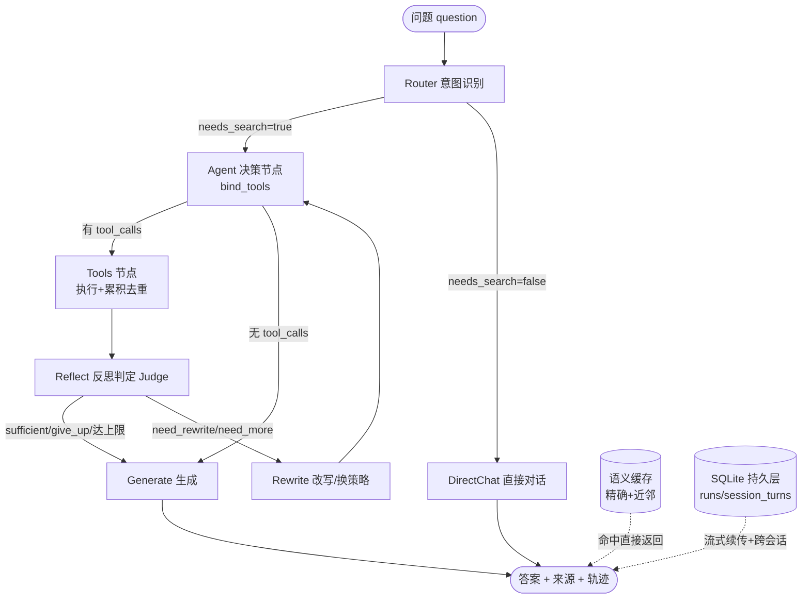

# Agentic RAG 实现笔记（运行时流程与关键逻辑）

> 文档版本：v1.0
> 创建日期：2026-07-19
> 所属分支：`feat/agentic-rag`
> 定位：**实现笔记**，记录代码真实运行时的流程与关键逻辑。架构决策/ADR 见 `agentic-rag-design.md`，本文件不重复讨论"为什么这么选"，只讲"现在是怎么跑的"。
> 代码基线：`src/note_assistant/agent/`、`src/note_assistant/llm/`、`src/note_assistant/api/main.py`

---

## 0. 一句话概览

一条 **ReAct 范式的 LangGraph 自写状态图**：进来一个问题 → Router 判要不要检索 → 要检索就进"检索循环"（调工具 → 累积去重 → 反思 Judge 判够不够 → 不够就改写/换策略再来一轮）→ 够了就生成带引用的答案；闲聊类直接对话不检索。循环外挂着**语义缓存**（省成本）、**SQLite 持久层**（流式续传 + 跨会话记忆）、**评测闭环**（轨迹级指标）。

---

## 1. 整体链路



图由 `agent/agent.py::build_graph()` 编译（用 `@lru_cache` 缓存，全局只编译一次）。

---

## 2. 状态：`AgentState`

`agent/agent.py` 里用 `TypedDict` 定义，是贯穿整张图的"黑板"：

| 字段 | 类型 | 含义 |
|---|---|---|
| `messages` | `list[BaseMessage]`（add_messages 累加） | 完整对话消息流（Human/AI/Tool），决定 LLM 每一步能"看到"什么 |
| `accumulated` | `List[RetrievalResult]` | **Context Accumulator**：各轮检索结果去重后累积 |
| `iteration` | `int` | 已执行的检索轮次（Tools 节点每跑一次 +1） |
| `route` | `str` | `"search"` / `"chat"`，由 Router 写入，决定主分支 |
| `question` | `str` | 原始问题，供 Generate/Judge 引用 |
| `history` | `list` | 跨会话历史（来自 session 或调用方传入），仅 Generate 用于追加上下文 |
| `answer` | `str` | 最终答案 |
| `judge_verdict` | `str` | 最近一次 Judge 判定：`sufficient`/`need_rewrite`/`need_more`/`give_up` |
| `rewritten_query` | `str` | Judge 建议的改写查询 |
| `judge_log` | `list`（operator.add 累加） | 每轮 Judge 决策事件，**可观测、可回放** |

---

## 3. 各节点详解

> 所有节点都是 `async def node(state) -> dict`，返回要合并进 state 的增量。

### 3.1 Router（意图识别）
- 用 `temperature=0.0` 的 LLM 跑 `ROUTER_SYSTEM` 分类器，要求输出 JSON `{"needs_search": bool, "reason": "..."}`。
- `_extract_json()` 容错抠 JSON（兼容 ```json 代码块、前后多余文本）。
- **异常即默认检索**：解析失败兜底 `needs_search=True`（宁可多检索也不漏答）。
- 返回 `{"route": "search" | "chat"}`。

### 3.2 Agent（决策节点）
- `get_llm(temperature=0.3).bind_tools(AGENT_TOOLS)`，看 `state.messages`（含 System + 历史累积）决定下一步。
- 返回 `{"messages": [AIMessage]}`。若 AIMessage 带 `tool_calls` → 走 Tools；否则 → 走 Generate（分支函数 `_agent_branch` 据此判断）。

### 3.3 Tools（工具执行 + 累积去重）
- 取 `messages[-1]`（Agent 的 AIMessage），逐个 `tool_calls` 调 `run_tool_call()`（放到 `asyncio.to_thread` 避免阻塞事件循环，因为 `query_rewrite` 内含同步 LLM 调用）。
- **确定性去重**：用 `(filepath, heading_path)` 作 key，已累积的跳过，不依赖 LLM。
- `iteration += 1`，返回 `{"messages": [ToolMessage...], "accumulated": ..., "iteration": ...}`。

### 3.4 Reflect（反思判定 Judge）—— 核心可观测节点
- `temperature=0.0` 的 LLM 跑 `JUDGE_SYSTEM`，输出 JSON：`{"verdict", "reason", "rewritten_query"}`。
- 四种 verdict 语义：
  - `sufficient`：信息够 → 生成。
  - `need_rewrite`：不够但改写查询可能找到 → 走 Rewrite（用 `rewritten_query`）。
  - `need_more`：不够，换检索策略/工具再查（不改写查询）→ 走 Rewrite（不带改写提示）。
  - `give_up`：多次仍无内容 → 生成，并在答案里标注"信息有限"。
- `_norm_verdict()`：非法值默认 `sufficient`，**防无限循环**。
- **硬性降级**：`iteration >= MAX_ITER` 时无论判定如何都强制进 Generate（分支 `_reflect_branch`）。
- 异常兜底：`iteration >= MAX_ITER` → `sufficient`；否则 `need_more`。
- 每轮把判定写进 `judge_log`（带 `iteration`、`verdict`、`rewritten_query`），供回放。

### 3.5 Rewrite（改写 / 换策略）
- 若 `rewritten_query` 存在且不同于原问题 → 注入提示"请基于改写后的查询重新检索：{q}"。
- 否则 → 注入提示"请尝试其它检索工具/策略（vector_search / bm25_search / filtered_search / graph_expand）再查一次"。
- 返回 `{"messages": [HumanMessage(hint)]}` → 回到 Agent 节点。

### 3.6 Generate（生成答案）
- `temperature=0.6, max_tokens=2048` 的 LLM 跑 `GENERATE_SYSTEM`。
- 上下文来自 `_format_context(_top_k_context(accumulated))`：
  - **Top-K 裁剪**：按 `score` 降序截到 `settings.top_k_rerank`，防超窗口。
  - 空上下文 → 如实告知"知识库中缺少相关信息"。
- 追加 `history`（最近 20 轮，`_fmt_history` 转成 Human/AI 消息）。
- **降级提示**：`judge_verdict == "give_up"` 或（达上限且无累积）→ 答案末尾加"（注：已多次检索但知识库中相关信息有限…）"。

### 3.7 DirectChat（闲聊）
- `temperature=0.6, max_tokens=1024`，`CHAT_SYSTEM` 友好回复，**完全不检索**，省 token。

---

## 4. 三个关键逻辑

### 4.1 Context Accumulator（多跳不丢信息）
- 每一轮 Tools 把新 `RetrievalResult` 按 `(filepath, heading_path)` **确定性去重**后追加进 `state.accumulated`。
- 生成前再做一次 **Top-K 分数裁剪**（`_top_k_context`），既保证多跳信息完整，又避免超长上下文。
- 去重是确定性的（不靠 LLM），所以可复现、可测试。

### 4.2 Reflection Judge 决策树
```
iteration >= MAX_ITER ? ──是──> 强制 Generate（降级）
        │否
        └─> Judge 判定
              ├─ sufficient    -> Generate
              ├─ give_up       -> Generate（带"信息有限"提示）
              ├─ need_rewrite  -> Rewrite（注入 rewritten_query）-> Agent
              └─ need_more     -> Rewrite（换策略提示）         -> Agent
```
这是 Agentic 区别于 Naive RAG 的核心：`retrieve → reflect → (retry) → generate` 的闭环。

### 4.3 工具韧性（重试 / 降级 / 兜底）
`run_tool_call(name, args)` 是工具统一入口，三层防护：
1. **重试**：`_retry()` 按 `agent_max_tool_retry` 次重试，全失败才抛。
2. **降级**：`hybrid_search` 全失败 → 自动降级 `vector_search`（仍带提示文本）。
3. **兜底**：任何工具最终失败 → 返回 `（工具 X 调用失败，已跳过）` + 空结果，**绝不拖垮主链路**。

---

## 5. 运行器：`runner.py`

封装 `ainvoke`（非流式）与 `astream`（流式），并挂缓存与持久化。

### 5.1 `ainvoke(question, history, session_id, run_id)`
1. 解析历史：有 `session_id` 且持久化开启 → 从 SQLite 取 `session_turns`；否则用传入 `history`。
2. **缓存命中** → 直接返回（仍登记 run 以便轮询），`cached=True`。
3. 否则跑 `build_graph().ainvoke(state)`，从 final state 拼轨迹（`_trajectory_from_state`：路由 → 工具/观察 → Judge → 答案 → sources）。
4. 写缓存 + `_record_run` 落盘。

### 5.2 `astream(...)` —— 流式事件流
逐项 `yield` 轨迹事件，事件类型：`run` / `thought` / `tool_call` / `observation` / `judge` / `answer` / `sources` / `cached` / `status` / `error`。
- **首事件 `{"type":"run","run_id":...}`** 是续传锚点：客户端断流后拿这个 `run_id` 去轮询。
- 每个事件实时 `append_event(rid, ev, seq)` 落盘（不阻塞：包 `asyncio.to_thread`）。
- 三种进入路径：
  - **续传**：给定存在的 `run_id` → 直接回放已落盘轨迹（若未完成则提示轮询）。
  - **缓存命中**：回放缓存轨迹（并登记 run）。
  - **正常流式**：实时产出并落盘。

### 5.3 轨迹构造
- `_trajectory_from_messages`：从消息抽 `tool_call` / `observation` / `thought`。
- `_sources_from_results`：按 score 截 `top_k_rerank` 条，输出 `{filepath, title, heading, score}`。
- `OBS_TRUNCATE = 500`：observation 文本截断，避免轨迹过大。

### 5.4 持久化写入 `_record_run`
统一写入：run 事件 + `set_answer` + `set_sources` + `finish_run`；若 `session_id` 存在再 `append_turn(user)` / `append_turn(assistant)`。

---

## 6. 语义缓存：`cache.py`

两级命中，省成本降延迟：
1. **精确缓存**：问题归一化（去空白/小写/折叠空格）→ SHA256 命中。零依赖，始终可用。
2. **语义近邻**：注入 `embed_fn`（生产接 `OllamaEmbedder.embed_one`）→ 余弦相似度 ≥ `agent_cache_semantic_threshold`（0.92）即命中。

防护与淘汰：
- `embed_fn` 调用全包 try/except，失败自动降级"仅精确命中"。
- **FIFO 淘汰** + **TTL 过期**（`agent_cache_ttl`），内存可控。
- `stats()` 暴露命中率，便于观察。
- 全部外部异常都不上抛到主链路。

---

## 7. 持久层：`store.py`（轻量 SQLite）

选 SQLite 而非 LangGraph checkpointer：本地优先项目要的是"**断流后轮询拿结果**"而非"从断点续跑图"，轮询快照更简单、确定、跨进程（服务重启也能取回）。

三张表：
| 表 | 作用 |
|---|---|
| `runs` | 运行快照：run_id / question / status / answer / sources / 时间戳 |
| `run_events` | 轨迹事件：run_id + seq（有序）+ event_json，**流式实时落盘** |
| `session_turns` | 跨会话记忆：session_id + idx + role + content |

关键方法：
- `create_run` / `ensure_run`（续传登记，INSERT OR IGNORE）/ `append_event` / `set_answer` / `set_sources` / `finish_run`。
- `get_run(run_id)`：**孤儿检测**——`status=='running'` 且超 `agent_run_orphan_ttl`（默认 600s）未结束 → 降级为 `interrupted`（服务崩溃兜底）。
- `append_turn` / `get_history`（最近 20 轮，正序返回，可直接喂 Generate）。

开关：`get_store()` 在 `agent_session_enabled=False` 时返回 `None`，整套持久化优雅退化无状态。`_record_run`/`astream` 对 `store is None` 全部跳过。

---

## 8. 接口层：`api/main.py`

| 端点 | 方法 | 作用 |
|---|---|---|
| `/agent/ask` | POST | 非流式问答，返回 `AgentAskResponse`（answer/sources/trajectory/cached/run_id/session_id） |
| `/agent/ask_stream` | POST | SSE 流式，逐个 `data: {event}` 推送（见 §5.2 事件类型） |
| `/agent/runs/{run_id}` | GET | 取运行快照 `AgentRunStatus`（404/503 处理）；断流后续传锚点 |
| `/agent/sessions/{session_id}` | GET | 取跨会话历史 `AgentSessionHistory` |

请求体 `AskRequest` 含 `question` / `history` / `session_id` / `run_id`。持久化关闭时两个 GET 端点返回 503。

---

## 9. 评测闭环：`evaluation.py`

离线"轨迹级"评测：
- `GOLDEN_QUESTIONS`：覆盖需检索 / 闲聊 / 多子话题 / 对比。
- `extract_metrics`：从一次 `AgentRunResult` 抽指标——路由分布、检索轮次、工具调用分布、Judge 判定、来源数、延迟。
- `aggregate`：汇总为均值 + 分布，输出 JSON 到 `data/eval_agent.json`。
- `evaluate_with_ragas`：**守卫式**接入（无 ragas / 异常则跳过），算 faithfulness / answer_relevance，不阻塞主流程。
- `run_fn` 可注入 → 完全离线（fake runner）验证聚合逻辑。

运行：`uv run python -m note_assistant.agent.evaluation`。

---

## 10. 配置项清单（`config.py`）

| 配置 | 默认 | 说明 |
|---|---|---|
| `llm_model` | `deepseek-v4-flash` | DeepSeek 模型 |
| `deepseek_api_key` / `deepseek_base_url` | — / `https://api.deepseek.com/v1` | LLM 通道 |
| `agent_max_iter` | `3` | 检索循环上限（硬性降级） |
| `agent_max_tool_retry` | `2` | 单次工具失败重试次数 |
| `agent_cache_enabled` | `True` | 语义缓存总开关 |
| `agent_cache_ttl` | `3600` | 缓存 TTL（秒） |
| `agent_cache_max_size` | `1000` | 缓存条数（FIFO） |
| `agent_cache_semantic` | `True` | embedding 近邻命中 |
| `agent_cache_semantic_threshold` | `0.92` | 近邻相似度阈值 |
| `agent_session_enabled` | `True` | 持久化总开关（False→无状态） |
| `agent_db_path` | `data/agent.sqlite` | SQLite 路径（相对/绝对） |
| `agent_run_orphan_ttl` | `600` | run 未完成超时判 interrupted |

---

## 11. 端到端时序（一次典型"需检索"请求）

```
客户端 POST /agent/ask_stream {question, session_id}
  └─ runner.astream
       ├─ 解析历史（session 优先）
       ├─ 缓存未命中 → create_run → yield {type:run, run_id}
       ├─ graph.astream(updates):
       │    router   → yield thought "路由判定：检索"
       │    agent    → yield tool_call(hybrid_search, {query})
       │    tools    → 累积去重；yield observation（截断500字）
       │    reflect  → yield judge(verdict)
       │    [若 need_*] rewrite → agent → tools → reflect ...（最多 agent_max_iter 轮）
       │    generate → yield answer
       ├─ yield sources（top_k_rerank 条）
       ├─ 实时 append_event 落盘 → finish_run
       └─ 若 session_id：append_turn(user) + append_turn(assistant)

断流场景：
  客户端拿到首个 run_id 后中断 → 重新 GET /agent/runs/{run_id}
       └─ store.get_run → 回放 trajectory；status!=finished 则提示轮询，finished 即取完整结果
```

---

## 12. 已知差距（本期未做）

- **权限/数据安全**：个人单用户 vault 无需租户隔离；若接口暴露到 localhost 之外需加鉴权。
- **多 agent 拆解**：复杂问题拆子问题并行检索+汇总；个人笔记单跳问题为主，暂不需要。

---

> 关联文件速查：
> - 图与节点：`src/note_assistant/agent/agent.py`
> - 运行器/缓存/持久化编排：`src/note_assistant/agent/runner.py`
> - 工具集与重试降级：`src/note_assistant/agent/tools.py`
> - 持久层：`src/note_assistant/agent/store.py`
> - 语义缓存：`src/note_assistant/agent/cache.py`
> - 评测：`src/note_assistant/agent/evaluation.py`
> - LLM 通道：`src/note_assistant/llm/client.py`
> - 接口：`src/note_assistant/api/main.py`
