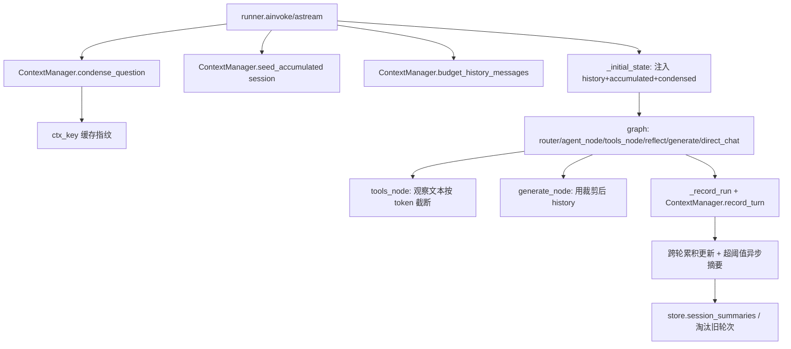

# ContextManager 设计方案（上下文管理模块）

> 状态：✅ 已落地 | 分支：`feat/context-management` | 日期：2026-07-24（设计）/ 2026-07-24（实现）

## 一、背景与问题

项目目前**没有独立的上下文管理模块**，相关逻辑零散分布：

| 位置 | 现状 | 问题 |
|---|---|---|
| `agent/agent.py` 的 Accumulator | 单轮内检索去重累积 | 不跨轮次，`_initial_state` 每次置空 |
| `agent/agent.py` 的 `_fmt_history()` | 简单截取最后 20 条 | 无压缩、无 token 预算、无相关性裁剪 |
| `agent/store.py` 的 `session_turns` 表 | 纯存纯取 | 无摘要/聚合/淘汰，无限增长 |

### 缺失的核心能力

- ❌ Token 预算管理（无窗口溢出保护）
- ❌ 上下文压缩（历史对话原样传递）
- ❌ 长程记忆（`session_turns` 无摘要聚合层）
- ❌ 按相关性裁剪（只按时间截断）
- ❌ 跨轮知识累积（`accumulated` 每轮重置）

### 代码探索中额外发现的缺口

1. **历史只喂给 `generate_node`，其余节点全失忆**（最严重）
   - `router` 只看 `state["question"]` → 追问"那它的缺点呢？"无法消解指代，可能误路由
   - `agent_node`（决定检索什么）看不到 history → 检索 query 带着未消解代词，检索必然失败
   - `direct_chat` 也不看 history → 多轮闲聊断片
   - 缺**问题凝练/指代消解（condense question）**步骤——多轮 RAG 标配
2. **语义缓存多轮串台（正确性 bug）**：`cache.get(question)` 只按问题文本命中，不掺 session/history。不同会话问同一句"它有什么优点？"会命中同一条缓存，返回错误答案
3. **`session_turns` 无限增长**：`get_history` 硬编码 `limit=20`，表本身无 TTL/上限/归档
4. **单轮内部窗口风险**：`tools_node` 把完整 `obs_text` 塞进 `ToolMessage` 回喂 LLM，检索循环内 messages 只增不减（`OBS_TRUNCATE=500` 仅用于轨迹展示，不用于喂 LLM）
5. **所有裁剪都按条数不按 token**：`_top_k_context` 按条数、`_fmt_history` 按轮数、`get_history` 按行数，一条超长回答就能撑爆预算

## 二、已确认的设计取舍

| 决策点 | 选择 | 说明 |
|---|---|---|
| Token 计数 | **tiktoken 精确计数** | 新增依赖；对 DeepSeek 为近似值，可接受 |
| 长程摘要 | **LLM 异步摘要** | 回答返回后后台执行，不阻塞主链路；超阈值触发滚动摘要 |
| 改造范围 | **仅 agent 通道** | `agent.py` / `runner.py` / `store.py` / `cache.py`；`rag_chain` 传统管线本次不动 |
| 缓存串台 | **key 掺入上下文指纹** | question + 凝练问题/历史摘要 hash，兼顾命中率与正确性 |

## 三、核心功能

- **问题凝练（condense）**：基于历史把当前追问改写为独立完整问题，供路由、检索、缓存指纹使用，消解"它/那"等指代。
- **Token 预算管理**：tiktoken 精确计数。设**总预算硬上限** `agent_total_context_token_budget`（模型窗口 − 输出预留），历史/累积/观察三段各自有默认子预算；若三段之和超总预算，按优先级 `obs → accumulated → history` 逐级压缩（history 最后才牺牲，对齐"历史优先"）。`tools_node` 回喂 LLM 的观察文本同样按 token 截断。
- **跨轮知识累积**：上一轮检索到的笔记片段（`RetrievalResult`）按 session 在内存中保留，下一轮初始状态带入，与新检索确定性去重合并。**双重保险淘汰**：①每跨一轮每个片段 `score × 0.9` 衰减；②按 token 预算硬截断，只保留有效分最高的若干条。
- **长程记忆**：`session_turns` 原文（user/assistant 轮次）的 **token 总和**超过 `agent_session_summary_threshold` 后，由 LLM 异步滚动摘要；取历史时返回"摘要 + 最近 N 轮原文"；表做上限/归档淘汰防无限增长。
- **相关性裁剪**：先做"最近 N 轮"时间窗口，再在窗口内按与**凝练问题**的 embedding 相似度 `> 阈值` 裁剪——窗口外轮次不进候选，避免"全高分=没裁剪"。embedder 可注入，失败或相关性开关关闭时降级为纯时间截断（与现状兼容）。
- **缓存串台修复**：`SemanticCache.get/put` 增加 `ctx_key`，精确命中与近邻命中均按上下文隔离。
- **各节点接入历史/凝练问题**：`router`、`agent_node`、`direct_chat` 不再失忆；`generate_node` 改用裁剪后历史。

## 四、实现策略

新建独立单文件模块 `src/note_assistant/agent/context.py`，承载 `ContextManager`（模块级单例 `get_context_manager()`，读取 settings）。`agent.py` 与 `runner.py` 均从 `context.py` 导入——`context.py` 不反向依赖二者，避免循环引用。

runner 在 `ainvoke`/`astream` 入口处先调用 `ContextManager` 完成凝练/取历史/取跨轮累积，再把结果注入 `_initial_state` 与图状态；节点内部按需调用 `ContextManager` 做截断与历史格式化。

### 关键技术决策与权衡

- **单文件模块而非子包**：项目既有 `store.py`/`cache.py`/`runner.py` 均为单文件模块，单文件更符约定；内部分区（TokenCounter / condense / prune / accumulate / summary）清晰即可。
- **跨轮累积用内存 dict 按 session_id 缓存**：`RetrievalResult` 含原始 `page_content`，`session_turns` 仅存文本无法重建片段；内存缓存覆盖单次服务生命周期（与现有全局 `_store`/`_cache` 单例一致），重启后自然降级为无累积，风险可控。
- **长程摘要异步化**：参考 runner 中"回答返回后落盘"的模式，摘要在 `_record_run` 之后用 `asyncio.to_thread` 后台执行，不计入用户延迟；阈值触发滚动摘要（合并最旧若干轮），摘要成功后删除已摘要原文轮次以限界增长。
- **相关性裁剪可降级**：`embed_fn` 为 None 或抛错时回落到时间截断，保证离线可测、无 Ollama 环境不崩。
- **缓存指纹**：精确 key 改为 `f"{question}::{ctx_key}"`，近邻匹配按 `ctx_key` 隔离。

### 防回归要点

- **不破坏现有 API**：`ainvoke/astream` 签名不变；`store.get_history` 保留（供 API GET 历史），新增 `get_history_with_summary` 专供 agent 路径；`build_graph` 仍 `@lru_cache`，节点内部取全局 `ContextManager`。
- **Token 计数性能**：tiktoken encoding 单例缓存；消息级计数处理 LangChain 多类型消息，仅对可字符串化 content 计数。
- **防御式降级**：LLM/embedding 失败走降级分支，不抛异常拖垮主链路；摘要与凝练均 `try/except` 包裹。
- **向后兼容**：condense/summary/relevance 均设开关配置，全部关闭时行为与现状一致（时间截断 20 条）。
- **测试隔离**：沿用 `tmp_path` 构造临时 store、monkeypatch `get_llm`/`embed_fn`/`get_context_manager`，全离线。

## 五、架构设计



## 六、文件改动清单

```
src/note_assistant/
├── agent/
│   ├── context.py    # [新增] ContextManager 核心模块：TokenCounter(tiktoken)、
│   │                 #   condense_question(LLM 凝练+降级)、budget_history_messages(相关性裁剪+token 预算)、
│   │                 #   seed_accumulated/record_turn(跨轮累积)、truncate_observation(token 截断)、
│   │                 #   maybe_summarize(异步长程摘要调度)、context_key(缓存指纹)。
│   │                 #   get_context_manager() 懒加载单例，全部依赖注入+失败降级。
│   ├── store.py      # [修改] 新增 session_summaries 表(session_id, idx_range, summary, created_at)；
│   │                 #   新增 save_summary / get_latest_summary / get_history_with_summary /
│   │                 #   enforce_session_cap(超上限删最旧轮次)；get_history 原签名兼容。
│   ├── agent.py      # [修改] AgentState 增加 condensed_question；router 用凝练问题+近期历史判意图；
│   │                 #   agent_node 可见预算后历史；tools_node 观察经 truncate_observation 回喂；
│   │                 #   generate_node 用 budget_history_messages 替代 _fmt_history；direct_chat 接收历史。
│   ├── runner.py     # [修改] 入口先算 condensed_question、取 prior accumulated、取预算后 history，
│   │                 #   注入 _initial_state；计算 ctx_key 传缓存 get/put；
│   │                 #   运行后 record_turn 更新跨轮累积并触发异步摘要。
│   └── cache.py      # [修改] get/put 增加 ctx_key 参数，精确/近邻命中均按上下文隔离。
├── config.py         # [修改] agent 段新增：agent_context_token_budget、agent_history_token_budget、
│                     #   agent_obs_token_budget、agent_condense_enabled、agent_summary_enabled、
│                     #   agent_session_summary_threshold、agent_session_max_turns、
│                     #   agent_history_relevance_enabled。
tests/agent/
└── test_context.py   # [新增] 离线测试：token 计数、condense 降级、预算裁剪、跨轮累积 seed、
                      #   摘要触发、缓存指纹、store 摘要存取。
pyproject.toml        # [修改] 新增 tiktoken 依赖（uv add tiktoken）。
```

## 七、关键接口（节选）

```python
# src/note_assistant/agent/context.py
class ContextManager:
    def count_tokens(self, text_or_messages) -> int: ...
    async def condense_question(self, current: str, history: list[dict]) -> str: ...
    def context_key(self, condensed: str, summary: str = "") -> str: ...
    def budget_history_messages(self, history: list[dict], condensed: str,
                                token_budget: int) -> list[BaseMessage]: ...
    def seed_accumulated(self, session_id: str) -> list[RetrievalResult]: ...
    def record_turn(self, session_id: str, accumulated: list[RetrievalResult],
                    user_q: str, assistant_a: str) -> None: ...
    def truncate_observation(self, text: str, token_budget: int) -> str: ...
    async def maybe_summarize(self, session_id: str) -> None: ...
```

## 八、实施步骤（Todo）

1. 在 `pyproject.toml` 加 tiktoken，并在 `config.py` 增加上下文/摘要/相关性配置项
2. 为 `store.py` 增加 `session_summaries` 表与摘要存取、带摘要历史查询、会话上限淘汰
3. 新建 `context.py` 实现 ContextManager：token 计数、凝练、预算裁剪、跨轮累积、观察截断、异步摘要、缓存指纹
4. 改造 `agent.py`：AgentState 加 `condensed_question`，router/agent_node/direct_chat 接入历史，tools_node 截断观察，generate_node 用裁剪历史
5. 改造 `runner.py`：入口凝练问题、注入跨轮累积与预算历史、计算 ctx_key、运行后 record_turn 触发摘要
6. `cache.py` 的 get/put 支持 ctx_key，精确与近邻命中按上下文隔离防串台
7. 新增 `tests/agent/test_context.py` 离线测试覆盖计数、凝练降级、裁剪、累积、摘要、指纹
